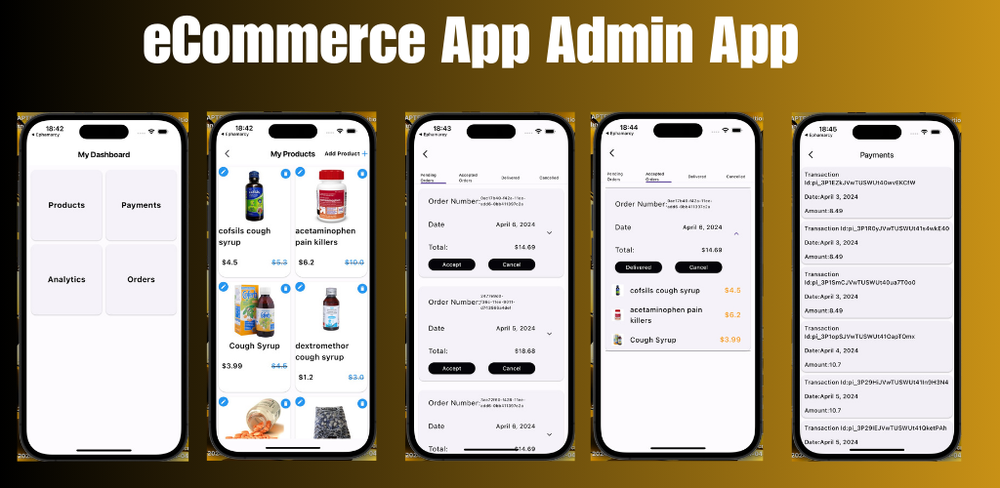

# ecommerceadmin App with flutter ,firebase
<h3>This app is an admin app for an imaginary phamarcy store the app allows the admin to add , edit and delete products,  accept ,deliver and cancel orders</h3>
<h2>App Features</h2>
<ol>
<li>Adding ,Editting and deleting products</li>
<li>Accept , Deliver and cancel orders</li>
<li>Manage payments</li>
<li>Analytics</li>
  
</ol>

<h1>Youtube Video Tutorial Links Below</h1>
<a href="https://www.youtube.com/watch?v=81sGSVA8cO0&list=PLw0PWVv7CMzl6n9Q6ga2U1Y3tsgW7JD9Q">link text</a>

<h2>You can support my work by buying me a coffee below</h2>

